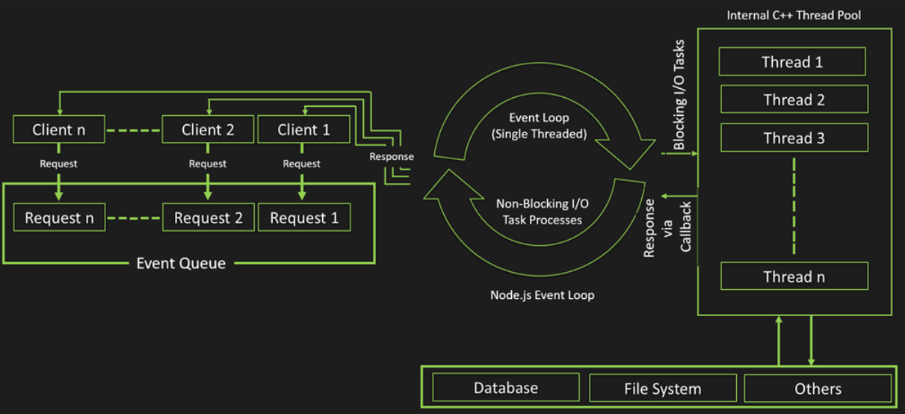

# JavaScript: Node Modules

Node.js uses modules to organize code into reusable components. There are three types of modules in Node.js:

1. Core Modules: Built-in modules provided by Node.js (e.g., http, fs, path).
2. Local Modules: Custom modules created by the developer.
3. Third-Party Modules: Modules installed from the NPM registry.

#### Creating a Local Module

To create a local module, create a new JavaScript file and export the necessary functions or variables:

```javascript
// math.js
function add(a, b) {
  return a + b;
}

function subtract(a, b) {
  return a - b;
}

module.exports = { add, subtract };

// app.js
const math = require("./math");

console.log(math.add(5, 3)); // Output: 8
console.log(math.subtract(5, 3)); // Output: 2
```

#### NPM (Node Package Manager)

NPM is the default package manager for Node.js. It allows developers to install, share, and manage third-party packages.

##### Initializing a Project

To initialize a new Node.js project, run the following command in your project directory:

```javascript
    npm init
```

##### Installing Packages

You can install packages using the `npm install` command:

```javascript
const express = require("express");
const app = express();

app.get("/", (req, res) => {
  res.send("Hello, World!");
});

const PORT = 3000;
app.listen(PORT, () => {
  console.log(`Server running at http://localhost:${PORT}/`);
});
```

#### Node.js Event Loop

The Node.js event loop is what allows Node.js to perform non-blocking I/O operations despite the fact that JavaScript is single-threaded. It handles all asynchronous operations by offloading them to the system kernel whenever possible.


